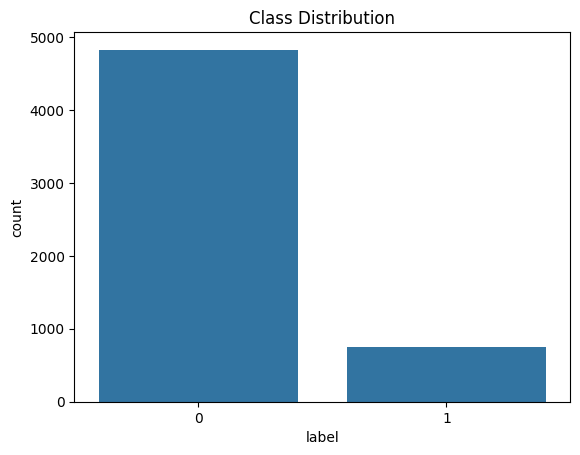
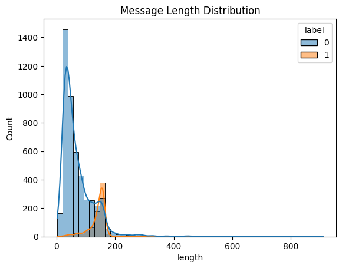
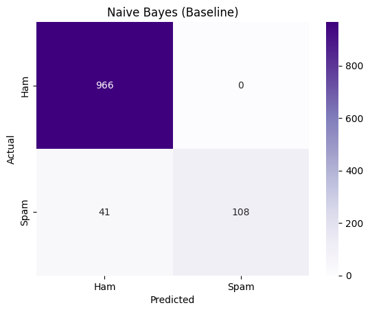
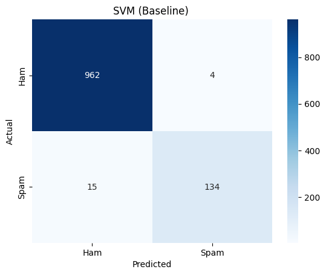
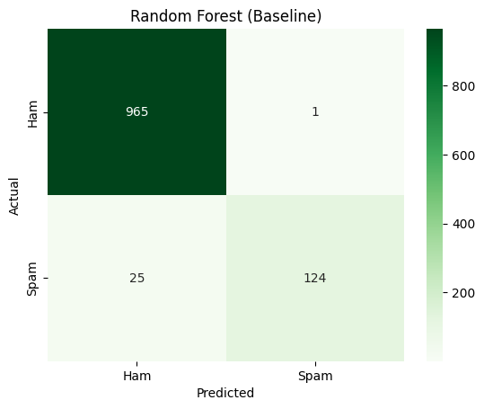
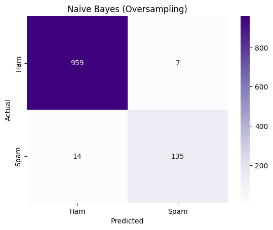
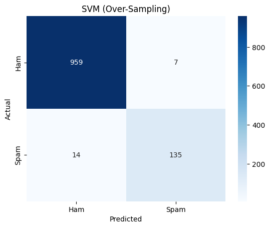
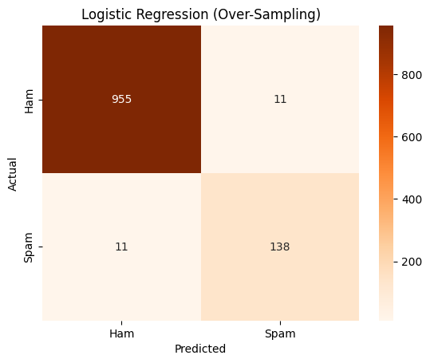

# 📧 Email Spam Detection with Machine Learning

## 📌 Project Overview

Spam messages are a major challenge in digital communication systems, often containing promotional content, scams, or phishing attempts. Automatically identifying these messages is crucial for improving user experience and security.

This project builds a **machine learning-based spam detection system** that classifies messages into:

* **Ham (0)** → Legitimate messages
* **Spam (1)** → Unwanted or harmful messages

Beyond basic classification, this project explores how different **class imbalance handling techniques** affect model performance.

---

## 🎯 Objectives

The main goals of this project are:

* Build and evaluate multiple machine learning models for spam detection
* Perform **Exploratory Data Analysis (EDA)** to understand patterns in the data
* Apply **Natural Language Processing (NLP)** techniques
* Investigate the effect of:

  * Baseline training (no balancing)
  * Oversampling (RandomOverSampler)
  * Class weighting
* Compare models using multiple evaluation metrics
* Identify the best-performing model for real-world use

---

## 📂 Dataset Description

* Total messages: **5,572**
* Ham (Non-Spam): **4,825 (87%)**
* Spam: **747 (13%)**

⚠️ The dataset is **imbalanced**, meaning models may favor predicting ham more often than spam.

---

## 🧹 Data Cleaning & Preprocessing

The dataset originally contained unnecessary columns with missing values:

* `Unnamed: 2`
* `Unnamed: 3`
* `Unnamed: 4`

### Steps performed:

* Dropped irrelevant columns
* Renamed columns to:

  * `label`
  * `message`
* Converted labels:

  * `ham → 0`
  * `spam → 1`
* Checked for missing values

---

## 🔍 Exploratory Data Analysis (EDA)

### 📊 Class Distribution

**Insight:**

* The dataset is heavily skewed toward ham messages
* This imbalance can affect model performance

---

### 📏 Message Length Distribution

**Insight:**

* Spam messages tend to be **longer and more structured**
* Ham messages are shorter and conversational
* Long messages (400–800 characters) were retained as they likely represent real spam

---

### 🔤 Word Frequency Analysis (Spam Messages)

* Common spam indicators include:

  * **free**
  * **call**
  * **txt**
  * **claim**
* These patterns make spam detection effective with NLP

---

## ⚙️ Text Preprocessing

To prepare text for modeling:

* Converted text to lowercase
* Removed punctuation
* Removed stopwords using NLTK
* Tokenized text

---

## 🔄 Feature Engineering

Text data was transformed into numerical features using:

### 🔹 TF-IDF Vectorization

* Converts text into weighted numerical representation
* Highlights important words while reducing noise

---

## 🔀 Train-Test Split

* Training set: **80%**
* Test set: **20%**
* Used **stratified sampling** to maintain class distribution

---

# 🤖 Modeling Approach

---

## 🔹 Baseline Models (No Imbalance Handling)

Models were first trained on the original dataset without any balancing.

### Models Used:

* Naive Bayes
* Logistic Regression
* Support Vector Machine (SVM)
* Random Forest

---

### 📊 Confusion Matrix — Naive Bayes (Baseline)

Here, the Naive Bayes Baseline model correctly classified almost all Ham messages (966), with no false positives. However, it struggled more with Spam, correctly identifying 108 but misclassifying 41 Spam messages as Ham. Overall, this shows the model is very strong at detecting Ham but weaker at catching Spam, which highlights the class imbalance problem.

---

### 📊 Confusion Matrix — SVM (Baseline)

The SVM baseline model shows stronger balance compared to Naive Bayes. From the confusion matrix, most Ham messages were correctly classified (962), with only 4 misclassified as Spam. For Spam, 134 were correctly identified, while 15 slipped through as Ham.

---

### 📊 Confusion Matrix — Random Forest (Baseline)

From the confusion matrix, 965 Ham messages were correctly classified, with only 1 misclassified as Spam. For Spam, 124 were correctly identified, while 25 were misclassified as Ham.

---

### 📊 Confusion Matrix — Logistic Regression (Baseline)

From the confusion matrix, 955 Ham messages were correctly classified, with 11 misclassified as Spam. For Spam, 139 were correctly identified, while 10 were misclassified as Ham. 

---

## ⚖️ Oversampling Experiment

To address class imbalance, **RandomOverSampler** was applied to the training data.

### Goal:

Improve the model’s ability to detect spam (increase recall)

---

### 📊 Confusion Matrix — Naive Bayes (Oversampling)

With Random Oversampling applied, the Naive Bayes model improved its balance between Ham and Spam detection. From the confusion matrix, 959 Ham messages were correctly classified with only 7 misclassified as Spam, while 135 Spam messages were correctly identified and 14 misclassified as Ham.

---

### 📊 Confusion Matrix — SVM (Oversampling)

From the confusion matrix, 959 Ham messages were correctly classified with 7 misclassified as Spam, while 135 Spam messages were correctly identified and 14 misclassified as Ham.

---

### 📊 Confusion Matrix — Random Forest (Oversampling)

 From the confusion matrix, 965 Ham messages were correctly classified with only 1 misclassified as Spam, while 130 Spam messages were correctly identified and 19 misclassified as Ham

---

### 📊 Confusion Matrix — Logistic Regression (Oversampling)

From the confusion matrix, 955 Ham messages were correctly classified with 11 misclassified as Spam, while 138 Spam messages were correctly identified and 11 misclassified as Ham. 

---

## 🎯 Class Weighting

Instead of modifying the dataset, class weighting adjusts how the model penalizes errors.

Applied to:

* Logistic Regression

---

### 📊 Confusion Matrix — Logistic Regression (Class Weight)

Applying class weighting with Logistic Regression gave results very similar to oversampling, From the confusion matrix, we could see that 955 Ham messages were correctly classified with 11 misclassified as Spam, while 139 Spam messages were correctly identified and 10 misclassified as Ham.

---

# 📊 Model Comparison

| Model               | Method       | Accuracy | Precision | Recall | F1 Score |
| ------------------- | ------------ | -------- | --------- | ------ | -------- |
| Naive Bayes         | Baseline     | 0.963    | 1.000     | 0.725  | 0.840    |
| Naive Bayes         | Oversampling | 0.981    | 0.951     | 0.906  | 0.928    |
| Logistic Regression | Baseline     | 0.981    | 0.927     | 0.933  | 0.930    |
| Logistic Regression | Oversampling | 0.980    | 0.926     | 0.926  | 0.926    |
| Logistic Regression | Class Weight | 0.981    | 0.927     | 0.933  | 0.930    |
| SVM                 | Baseline     | 0.983    | 0.971     | 0.899  | 0.934    |
| SVM                 | Oversampling | 0.981    | 0.951     | 0.906  | 0.928    |
| Random Forest       | Baseline     | 0.977    | 0.992     | 0.832  | 0.905    |
| Random Forest       | Oversampling | 0.982    | 0.992     | 0.872  | 0.929    |

---

# 🧠 Key Insights

Across all four models, the baseline results showed strong accuracy but clear imbalance, with Spam recall consistently weaker than Ham. After applying oversampling or class weighting, performance became more balanced, especially for Spam detection.

Naive Bayes improved substantially with oversampling, raising Spam recall from 0.72 to 0.91, though precision dropped slightly.
Logistic Regression performed consistently well, with both oversampling and class weighting yielding balanced metrics (precision ~0.93, recall ~0.93).
SVM achieved the highest baseline accuracy (0.983) and maintained strong precision and recall after oversampling, showing reliable performance across classes.
Random Forest had excellent precision (0.99) but weaker Spam recall in the baseline (0.83). Oversampling improved recall to 0.87, making it more balanced. Overall, oversampling and class weighting helped reduce false negatives for Spam, leading to more dependable spam detection. SVM and Logistic Regression stood out as the most balanced models, while Random Forest and Naive Bayes benefited most from oversampling adjustments.

---

# 🏁 Conclusion

* Class imbalance affects spam detection significantly
* Oversampling improves recall but may reduce precision
* Class weighting provides a cleaner alternative
* Best models:

  * **SVM → Best overall**
  * **Logistic Regression → Most balanced**

---

# 🛠️ Tech Stack

* Python
* Pandas, NumPy
* Scikit-learn
* NLTK
* Matplotlib, Seaborn

---

# ✨ Author

**Latifah Bashir**
Aspiring Data Analyst | Machine Learning Enthusiast
